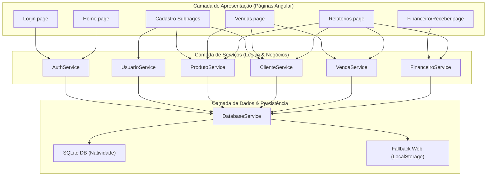
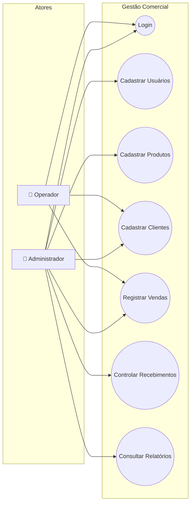
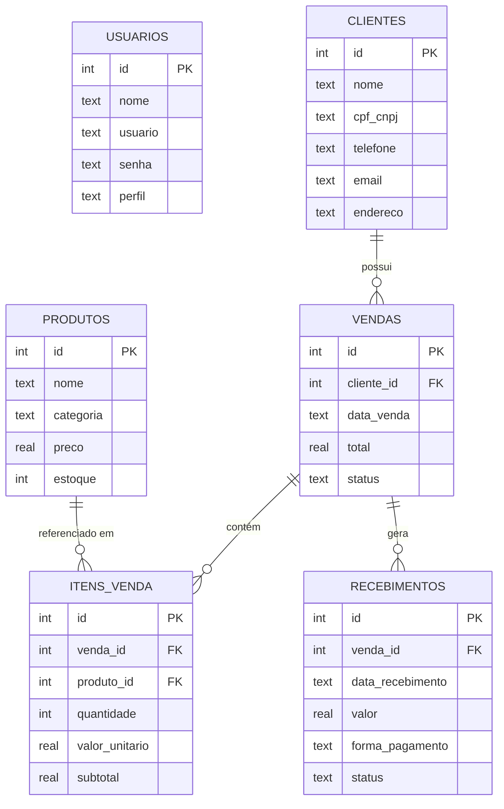
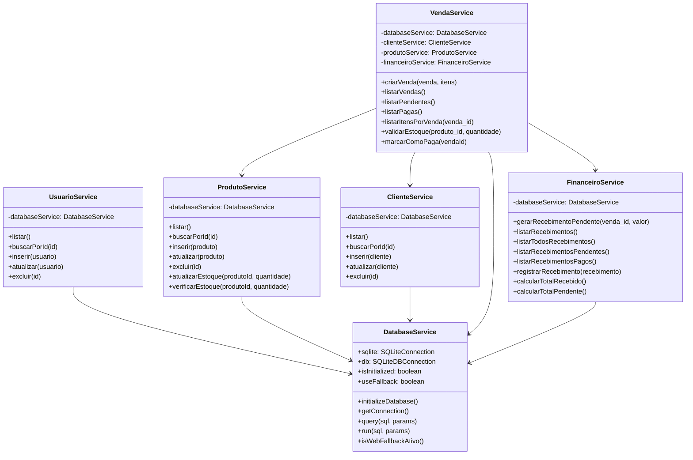
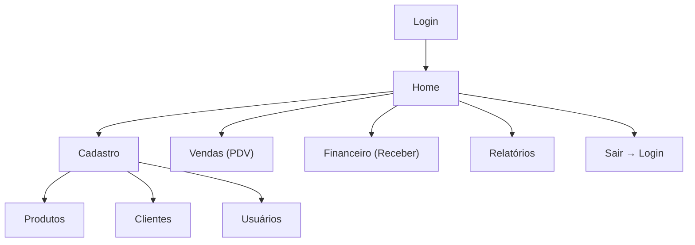
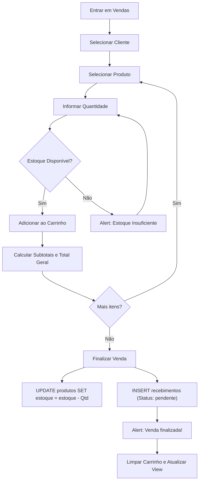
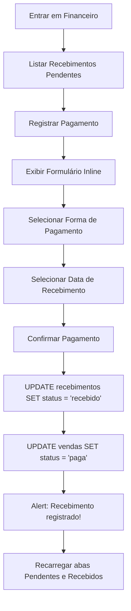
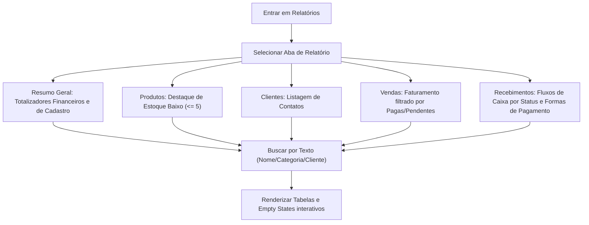

# 📦 Sistema de Gestão Comercial

[](https://ionicframework.com/)
[](https://angular.dev/)
[](https://sqlite.org/)
[](https://www.typescriptlang.org/)
[](#)

Aplicativo híbrido móvel e web de **Gestão Comercial** desenvolvido como atividade acadêmica para fins de consolidação de práticas de desenvolvimento SPA e persistência local.

---

## 👥 Autoria e Repositório
* **Autor:** Eduardo Henrryk Simonato
* **Repositório:** [https://github.com/EduardoHenrrykSimonato/sistema-gestao-comercial](https://github.com/EduardoHenrrykSimonato/sistema-gestao-comercial)
* **Status do Projeto:** ✅ Concluído (Todas as Etapas 1 a 7 implementadas, testadas e revisadas)

---

## 🎯 Objetivo e Descrição Geral
O projeto consiste em um sistema comercial simplificado de **Ponto de Venda (PDV)** e controle administrativo interno. Permite que pequenos estabelecimentos gerenciem usuários internos (com diferentes perfis de acesso), controlem o estoque de produtos, mantenham cadastros de clientes, realizem vendas com múltiplos itens (com baixa de estoque em tempo real), gerenciem o fluxo financeiro de contas a receber e visualizem um painel dinâmico de relatórios e métricas.

---

## 🛠️ Tecnologias Utilizadas

| Tecnologia | Finalidade / Detalhes |
|---|---|
| **Ionic 8** | Framework UI para criação de componentes nativos híbridos e mobile-friendly com design Dark Premium. |
| **Angular 20** | Framework SPA principal utilizando estrutura Standalone para melhor desempenho e injeção de dependências limpa. |
| **TypeScript 5.9** | Linguagem para tipagem estática e lógica dos serviços e componentes. |
| **Capacitor 8** | Bridge nativa para empacotamento em plataformas móveis (Android/iOS). |
| **SQLite (@capacitor-community/sqlite)** | Banco de dados local relacional para persistência nativa oficial. |
| **Fallback Web (LocalStorage/Memória)** | Mecanismo automático de desvio para permitir simulação e testes de todos os fluxos e CRUDs no navegador sem travar a aplicação. |

---

## 🏗️ Arquitetura do Sistema

O sistema foi estruturado seguindo o padrão de **Services Centralizados** e **Views Reativas**. Toda a manipulação de dados é feita por serviços especializados injetados nas páginas Angular, isolando a lógica de negócios da camada de apresentação. A persistência local se apoia no `DatabaseService`, que expõe os wrappers de execução SQL do SQLite ou redireciona as transações para a emulação em memória/localstorage se detectada a plataforma web.



---

## 📊 Diagramas do Sistema

### 1. Diagrama de Casos de Uso
Define os atores e o escopo de suas respectivas interações dentro do sistema de gestão comercial.



### 2. Diagrama Entidade-Relacionamento (ER)
Modelagem lógica do banco de dados relacional que armazena os dados do aplicativo.



### 3. Diagrama de Classes (Serviços e Dependências)
Estrutura de métodos e atributos expostos pelas classes de serviços principais.



### 4. Fluxo de Navegação de Telas
Mapeamento de rotas e fluxo geral de transições do aplicativo móvel/web.



### 5. Fluxo de Negócio — Registro de Vendas e Estoque
Processamento reativo desde a montagem do carrinho de compras até a baixa automática de estoque.



### 6. Fluxo de Negócio — Confirmação Financeira (Receber)
Processo de liquidação de contas a receber e alteração de status da transação de forma coordenada.



### 7. Fluxo de Negócio — Painel de Relatórios
Coleta de faturamento, estoque baixo e relatórios operacionais consolidados.



---

## 🗄️ Detalhes do Banco de Dados SQLite

O banco oficial de persistência local chama-se **`gestao_comercial_db`**. Ele é composto por 6 tabelas principais:

1. **`usuarios`**: Contém registros cadastrais dos operadores e administradores do sistema.
2. **`clientes`**: Armazena informações dos clientes para faturamento das vendas.
3. **`produtos`**: Registra itens em estoque, preço unitário e categoria.
4. **`vendas`**: Cabeçalho de vendas, registrando data, total e status.
5. **`itens_venda`**: Registra a associação N:N entre vendas e produtos, armazenando quantidade, valor unitário cobrado e subtotal.
6. **`recebimentos`**: Controla o fluxo de caixa a receber gerado automaticamente por cada venda.

---

## ⚙️ Instalação e Execução

### Pré-requisitos
Certifique-se de possuir o **Node.js (v18+)**, o gerenciador **npm** instalados, e instale o Ionic CLI globalmente:
```bash
npm install -g @ionic/cli
```

### Instalar dependências do projeto
```bash
npm install
```

### Executar no Navegador (Modo Desenvolvimento / Fallback Web)
```bash
ionic serve
```
Acesse `http://localhost:8100` no seu navegador. O console registrará a ativação do fallback de banco caso o driver nativo SQLite do Capacitor não esteja presente (comum no browser).

### Compilar e Build (Produção)
Para rodar a compilação completa do Angular e gerar o pacote pronto para deploy/distribuição móvel:
```bash
ionic build
```

---

## 👤 Credenciais de Acesso Padrão

Para realizar o login inicial e testar as funcionalidades do sistema:

* **Usuário:** `admin`
* **Senha:** `admin123`
