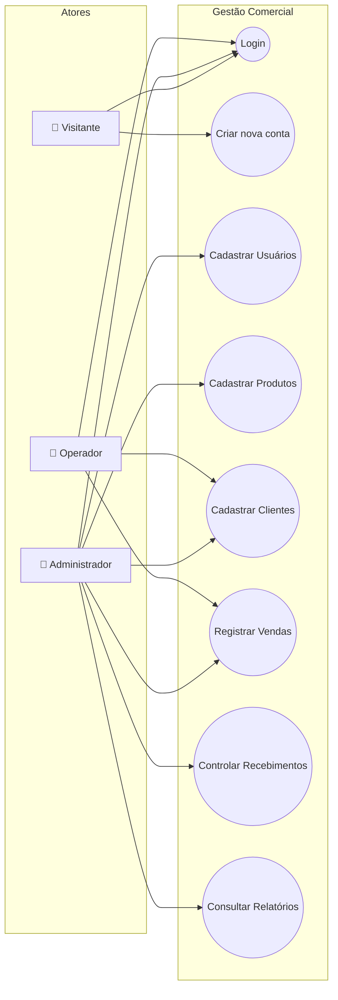
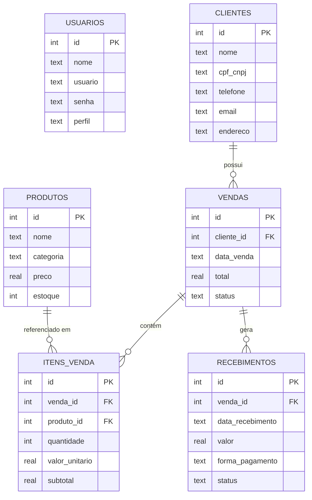
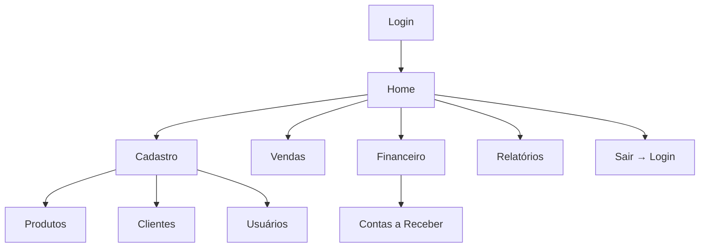
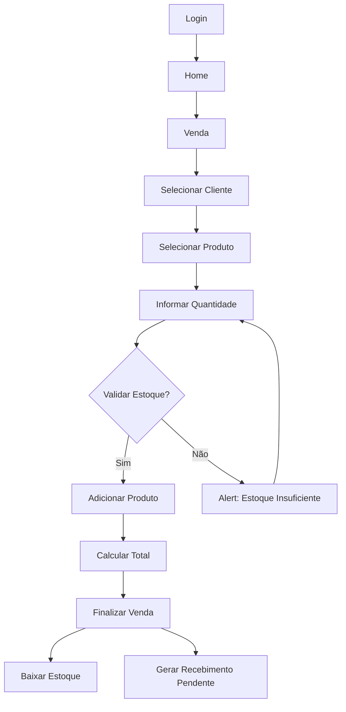
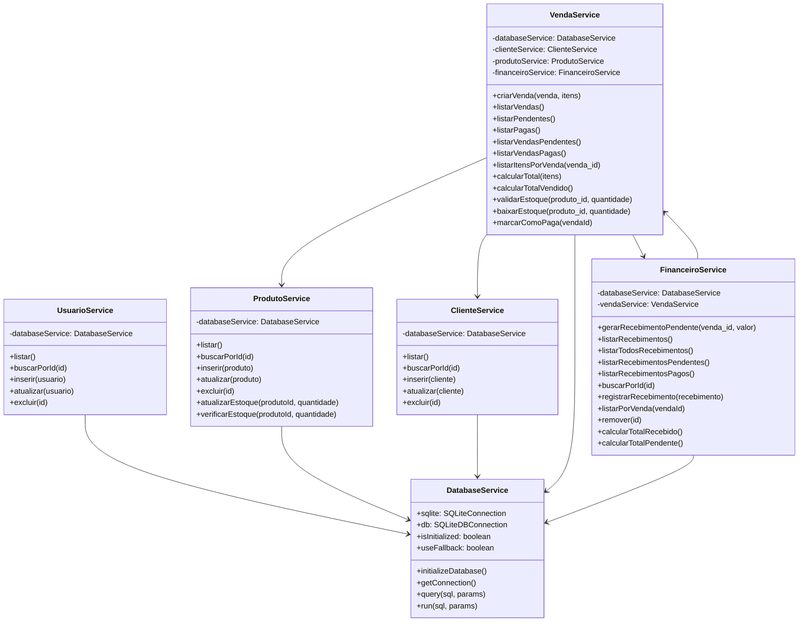
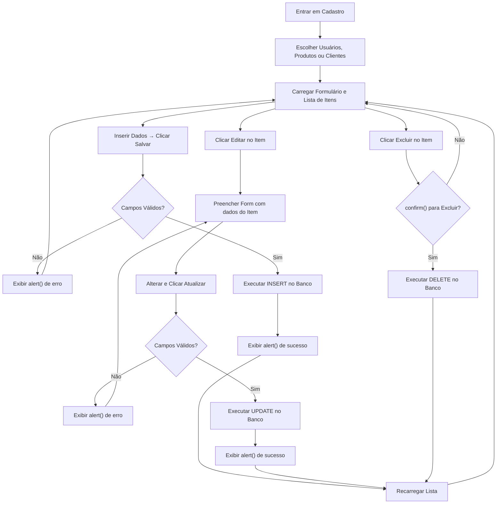
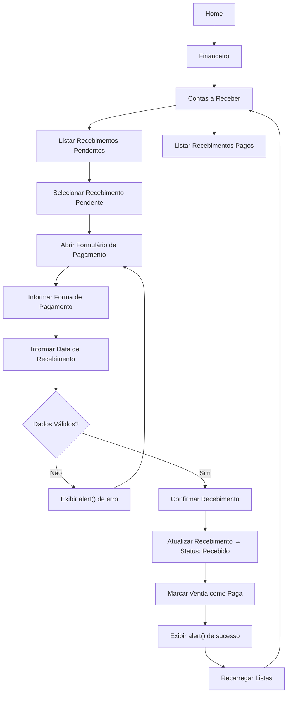
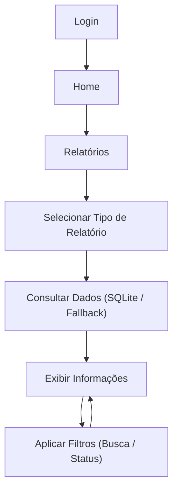
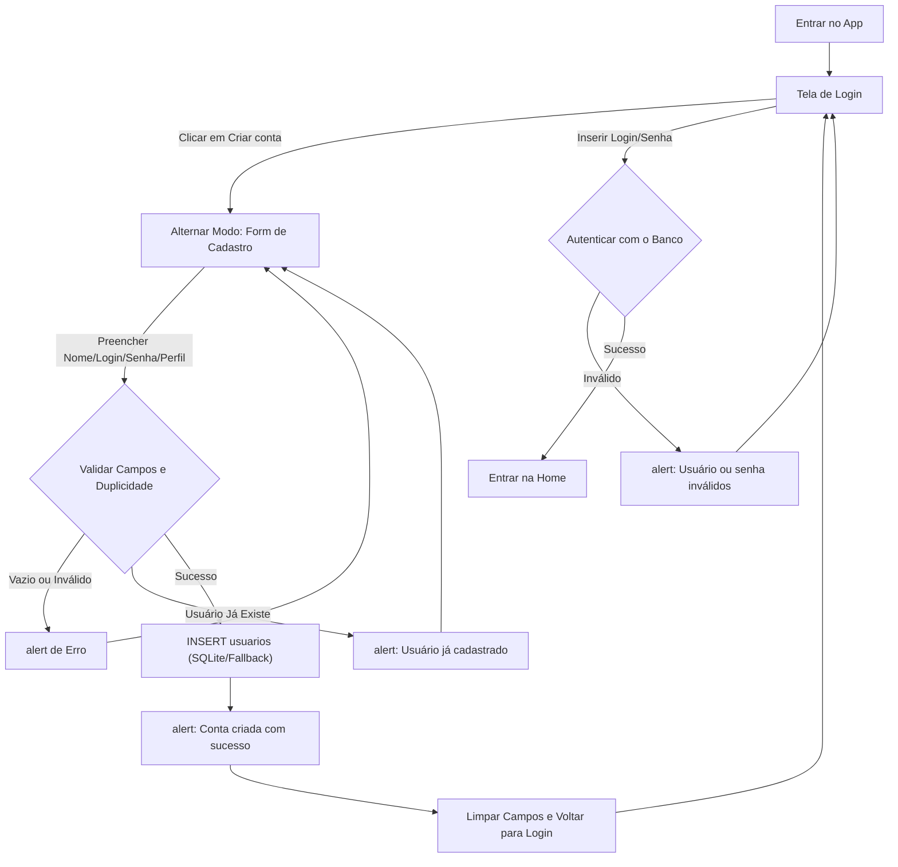

# 📊 Diagramas do Sistema

## Diagrama de Casos de Uso

## Diagrama Entidade-Relacionamento (ER)

## Fluxo de Navegação

## Fluxo de Venda

---

## Diagrama de Classes (Módulos Cadastro, Vendas e Financeiro)

---

## Fluxo do Módulo de Cadastro

---

## Fluxo do Módulo Financeiro / Receber

---

## Fluxo do Módulo de Relatórios

---

## Fluxo de Login e Criação de Conta

