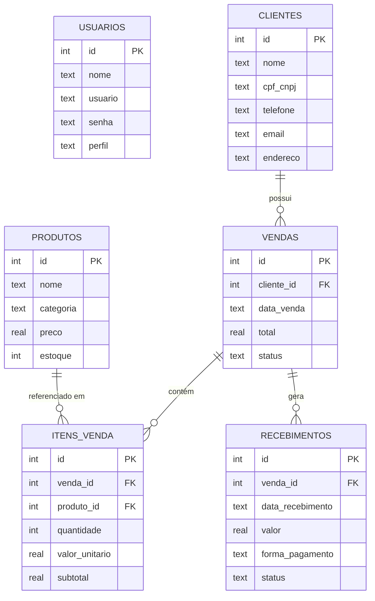
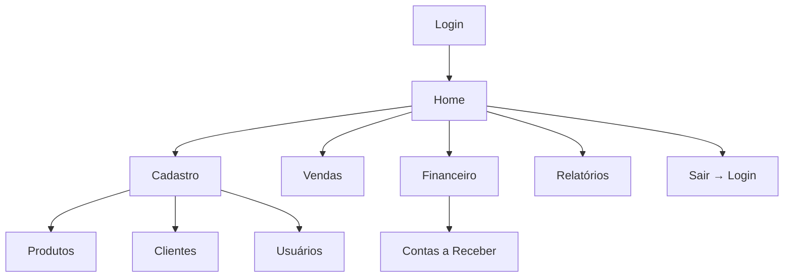
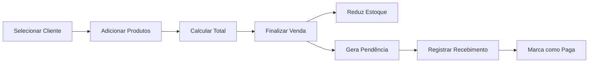
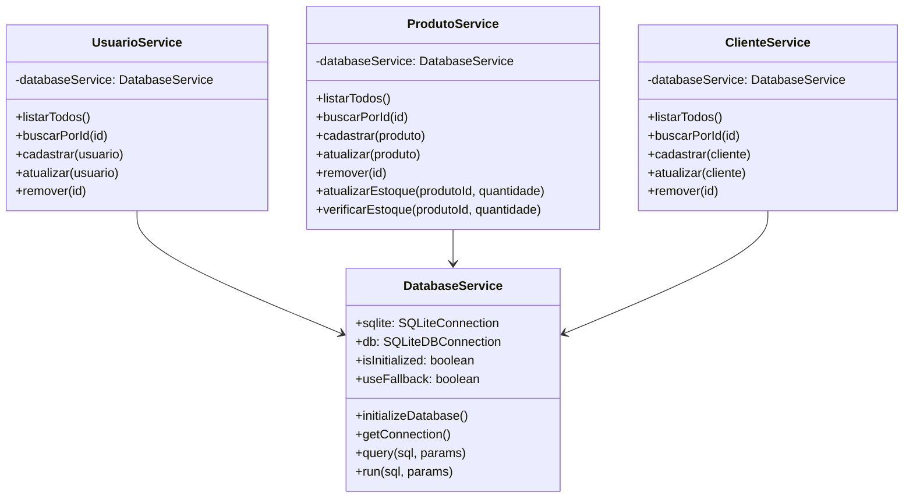
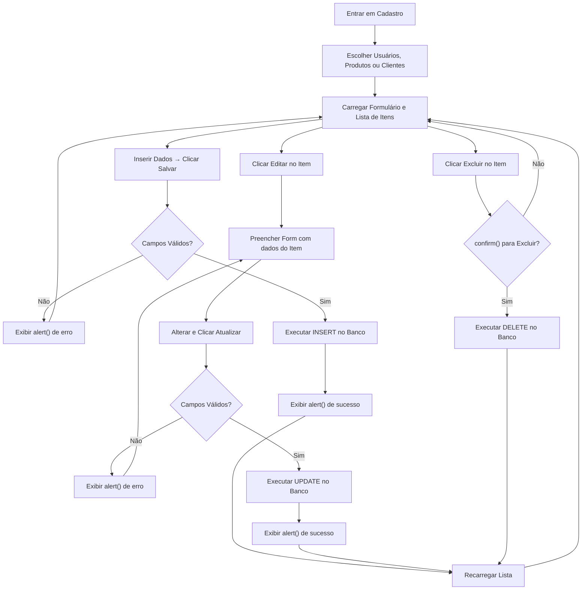

# 📊 Diagramas do Sistema

## Diagrama Entidade-Relacionamento (ER)

## Fluxo de Navegação

## Fluxo de Venda

---

## Diagrama de Classes (Módulo Cadastro)

---

## Fluxo do Módulo de Cadastro

